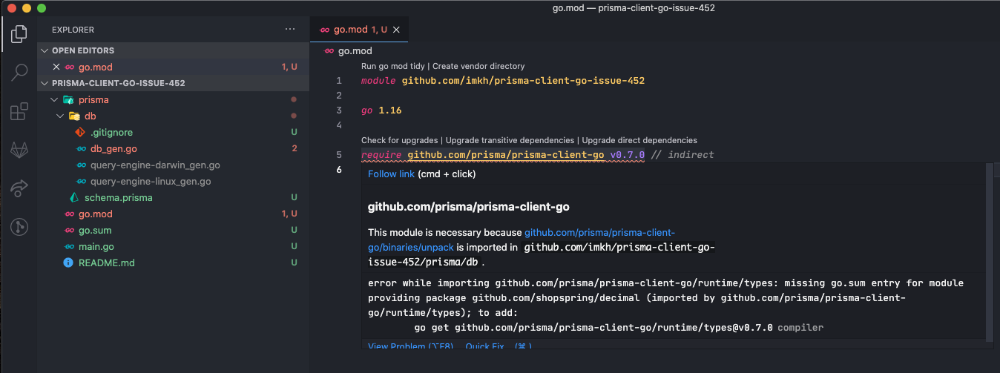

# Prisma Client Go Issue 452

Example project for https://github.com/prisma/prisma-client-go/issues/452.

1. Reset/clean up Go environment & caches as much as possible (probably useless but oh well)

```console
$ sudo rm -rvf ~/go/pkg/*
$ rm -rvf ~/go/bin/prisma-client-go
$ rm -rvf ~/go/src/*
$ go clean -cache
```

2. Clone and run the project

```console
$ git clone git@github.com:imkh/prisma-client-go-issue-452.git
$ cd prisma-client-go-issue-452
$ go get github.com/prisma/prisma-client-go
go: downloading github.com/prisma/prisma-client-go v0.7.0
go: downloading github.com/iancoleman/strcase v0.0.0-20190422225806-e506e3ef7365
go: downloading github.com/takuoki/gocase v1.0.0
go get: added github.com/prisma/prisma-client-go v0.7.0
$ go run github.com/prisma/prisma-client-go db push --preview-feature
Prisma schema loaded from prisma/schema.prisma
Datasource "db": PostgreSQL database "prisma-client-go-issue-452", schema "public" at "localhost:5432"

PostgreSQL database prisma-client-go-issue-452 created at localhost:5432


🚀  Your database is now in sync with your schema. Done in 58ms

✔ Generated Prisma Client Go to ./prisma/db in 1.59s

$ go run github.com/prisma/prisma-client-go generate
Prisma schema loaded from prisma/schema.prisma

✔ Generated Prisma Client Go to ./prisma/db in 1.94s

$ go run main.go
../../go/pkg/mod/github.com/prisma/prisma-client-go@v0.7.0/runtime/types/types.go:10:2: missing go.sum entry for module providing package github.com/shopspring/decimal; to add:
	go mod download github.com/shopspring/decimal

$ go mod download github.com/shopspring/decimal # Run this command
$ go mod tidy # Or this command
$ go run main.go # And it works
```



```console
$ go env
GO111MODULE=""
GOARCH="amd64"
GOBIN=""
GOCACHE="/Users/mehdikharraz/Library/Caches/go-build"
GOENV="/Users/mehdikharraz/Library/Application Support/go/env"
GOEXE=""
GOFLAGS=""
GOHOSTARCH="amd64"
GOHOSTOS="darwin"
GOINSECURE=""
GOMODCACHE="/Users/mehdikharraz/go/pkg/mod"
GONOPROXY="<REDACTED>"
GONOSUMDB="<REDACTED>"
GOOS="darwin"
GOPATH="/Users/mehdikharraz/go"
GOPRIVATE="<REDACTED>"
GOPROXY="https://proxy.golang.org,direct"
GOROOT="/usr/local/Cellar/go/1.16.2/libexec"
GOSUMDB="sum.golang.org"
GOTMPDIR=""
GOTOOLDIR="/usr/local/Cellar/go/1.16.2/libexec/pkg/tool/darwin_amd64"
GOVCS=""
GOVERSION="go1.16.2"
GCCGO="gccgo"
AR="ar"
CC="clang"
CXX="clang++"
CGO_ENABLED="1"
GOMOD="/Users/mehdikharraz/workspace/prisma-client-go-issue-452/go.mod"
CGO_CFLAGS="-g -O2"
CGO_CPPFLAGS=""
CGO_CXXFLAGS="-g -O2"
CGO_FFLAGS="-g -O2"
CGO_LDFLAGS="-g -O2"
PKG_CONFIG="pkg-config"
GOGCCFLAGS="-fPIC -arch x86_64 -m64 -pthread -fno-caret-diagnostics -Qunused-arguments -fmessage-length=0 -fdebug-prefix-map=/var/folders/1x/t8ffp29j2kzgh0y8xlk_wtnr0000gq/T/go-build3317377559=/tmp/go-build -gno-record-gcc-switches -fno-common"
```
